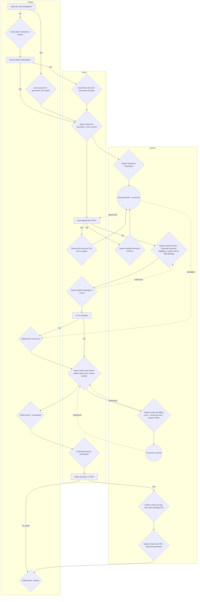

# Clinic Workflow

Reference workflow diagram covering the patient, nurse, and system interactions from registration through payment. Kept here for future reference when designing/aligning features against the real-world process.

