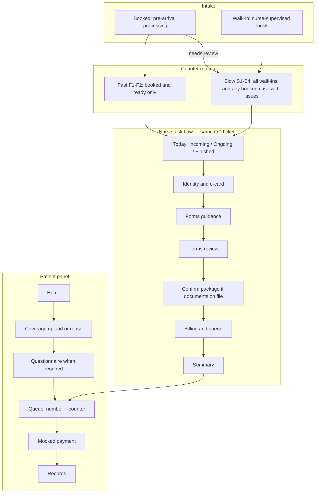

# Clinic Workflow

The first diagram is the as-is clinic process this product is designed against. The second diagram is how the current Epicenter demo implements that process across the patient panel, nurse panel, and FastAPI backend.

## As-is clinic process

## Implemented Epicenter path

Patient panel (`localhost:3000`): signed-in Home → coverage upload/reuse → questionnaire (when required) → Queue (queue number + assigned counter) → mocked Payment → Records.

Nurse panel (`localhost:3001`): Today board (Incoming / Ongoing / Finished) → open a ticket into the gated task flow. Walk-in kiosk is `/kiosk`. Database, Audit, and Simulator are separate destinations and do not interrupt the Today workflow.

### Nurse task gates

Opening a ticket walks through these persisted confirmations. Package is skipped when the ticket has no documents. Exceptions stay on the same ticket.

| Step | Screen | Gate |
| --- | --- | --- |
| 1 | Identity & e-card | Nurse attests the in-person identity check (`identity_confirmed`) |
| 2 | Forms guidance | System shows which forms apply; no separate confirm action |
| 3 | Forms review | Nurse confirms e-forms (`forms_confirmed`) |
| 4 | Confirm package | Nurse confirms CHAS/corporate package when documents exist (`package_confirmed`) |
| 5 | Billing & queue | Nurse confirms billing code, uncovered cost, and queue (`billing_confirmed`) |
| 6 | Summary | Queue number, counter, billing code, and uncovered cost |

### Counter assignment

- Walk-ins always receive a slow counter (`S1`–`S4`).
- Only booked patients with `readiness_state` `ready` receive a fast counter (`F1`–`F2`).
- The patient Queue screen and nurse dashboard both show the assigned queue number and counter.
- Overflow (simulator `dynamic_allocation` only): idle fast counters may take slow-queue patients when the fast queue is empty; overflow uses slow duration and does not preempt a fast case.
